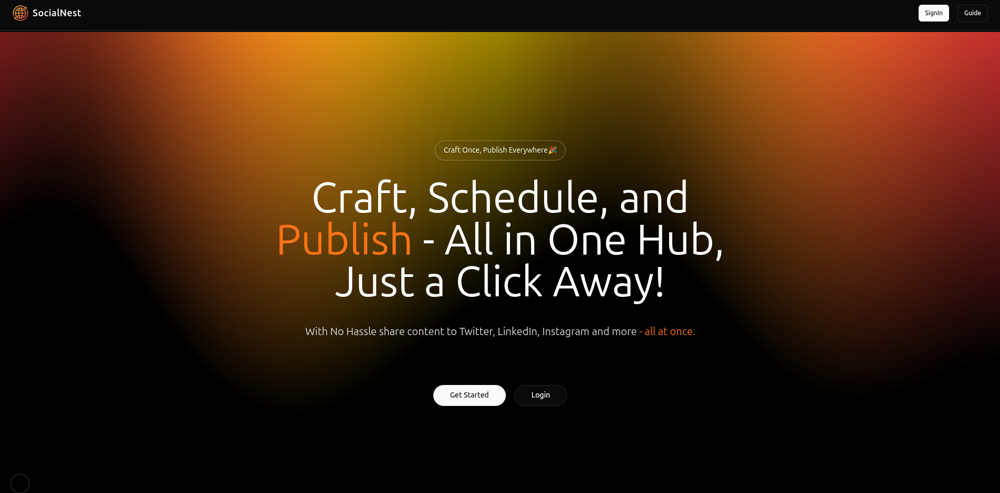

# 🌐 SocialNest

**Craft Once. Publish Everywhere.**

SocialNest is a modern all-in-one content management and scheduling platform that lets you **create, schedule, and publish** your social media content across multiple platforms like Twitter, LinkedIn, and Instagram — all from one unified dashboard.



## 🚀 Features

- 🌐 **Multi-Platform Posting** – Publish to Twitter, LinkedIn, and more in one click.
- ✨ **All-in-One Dashboard** – Manage content for multiple platforms from a single place.
- 📅 **Post Scheduling** – Set your content to go live exactly when you want.
- 🔐 **JWT Authentication** – Secure login and session management.
- 👀 **Instant Post Preview** – Preview your posts to ensure they look perfect before hitting "Publish".
- 📈 **Analytics Ready** – Integration-ready for performance tracking.
- ☁️ **Deployed on Vercel + EC2** – Seamless frontend/backend hosting.

---

## 🛠️ Tech Stack

### Frontend
- **Next.js 15**
- **Tailwind CSS** – Fully responsive, utility-first styling.
- **Zustand** – Lightweight global state management.
- **Framer Motion** – Elegant animations.
- **JWT-based Auth** – For authentication.

### Backend
- **Node.js + Express**
- **Prisma ORM** – Interact with PostgreSQL database.
- **PostgreSQL**
- **AWS S3** – For secure and scalable image storage.
- **JWT** – Secure cookie-based auth (HttpOnly).
- **Deployed on EC2**

---

## 🧑‍💻 Local Development Setup

### 1. Clone the repo

```bash
git clone https://github.com/Shivanipalya26/SocialNest.git
cd SocialNest
```

### 2. Set up the backend

```bash
cd server
pnpm install
```

- Copy .env.example to .env and fill in required values 

- Run dev server:

```bash
pnpm dev
```

---

### 3. Set up the frontend

```bash
cd ../client
pnpm install
```

- Copy .env.example to .env and fill in required values 

- Run dev server:

```bash
pnpm dev
```

---

## 📁 Folder Structure

```
socialnest/
├── client/             # Next.js frontend
│   ├── src/
│       ├── components/
│       ├── utils/
│       ├── store/      # Zustand state
│       └── ...
├── server/             # Express backend
│   ├── controllers/
│   ├── routes/
│   └── prisma/
└── README.md
```
---

## 🤝 Contributing

Pull requests are welcome! For major changes, please open an issue first to discuss your proposal.

---

## 📄 License

MIT License © 2025 [Shivani Palya]

---

## ✨ Inspiration

Built to make creators’ lives easier — one post at a time.
